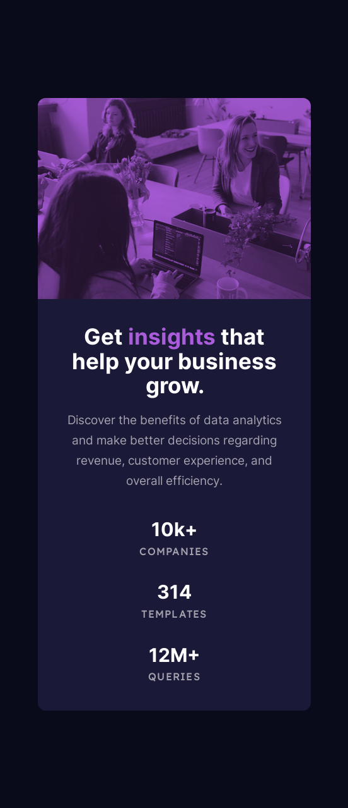

# Frontend Mentor - Stats preview card component solution

This is a solution to the [Stats preview card component challenge on Frontend Mentor](https://www.frontendmentor.io/challenges/stats-preview-card-component-8JqbgoU62). Frontend Mentor challenges help you improve your coding skills by building realistic projects.

## Table of contents

- [Overview](#overview)
  - [The challenge](#the-challenge)
  - [Screenshot](#screenshot)
  - [Links](#links)
- [My process](#my-process)
  - [Built with](#built-with)
- [Acknowledgments](#acknowledgments)

## Overview

### The challenge

Users should be able to:

- View the optimal layout depending on their device's screen size

### Screenshot

### Links

- Solution URL: [Frontend Mentor](https://www.frontendmentor.io/solutions/stats-preview-card-component-80rLdhK_6N)
- Live Site URL: [Netlify](https://lukeramljak-stats-preview-card.netlify.app/)

## My process

### Built with

- Semantic HTML5 markup
- CSS custom properties
- Flexbox
- CSS Grid
- Mobile-first workflow

## Acknowledgments

Struggled a lot with the image fitting in the container and the purple overlay on the image.
Sourced solutions from:

image - [@yoga-worksheet](https://www.frontendmentor.io/solutions/stats-preview-card-johwPyKbec)

overlay - [@mikhael7](https://www.frontendmentor.io/solutions/stats-preview-card-component-d7ZkT4W2BQ)
